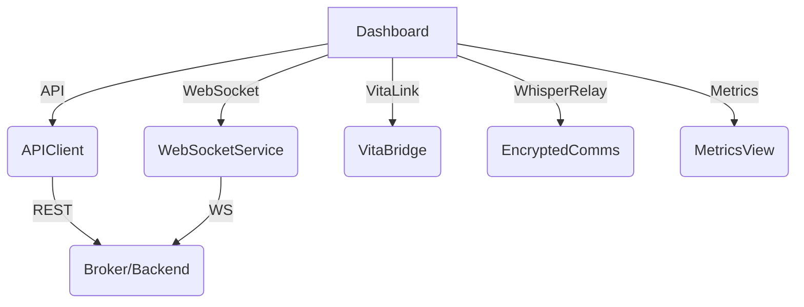

# Project Low-Key — System Overview

## Architecture

## Features
- FaceID/TouchID Auth
- Terminal & Logs
- Real-time WebSocket Core
- VitaLink, WhisperRelay, AdrenalineX hooks
- Metrics & Monitoring
- Profiles & Device States
- Whisper Mode
- ModKit (root features)
- Network Map
- Inline AI Assistant 